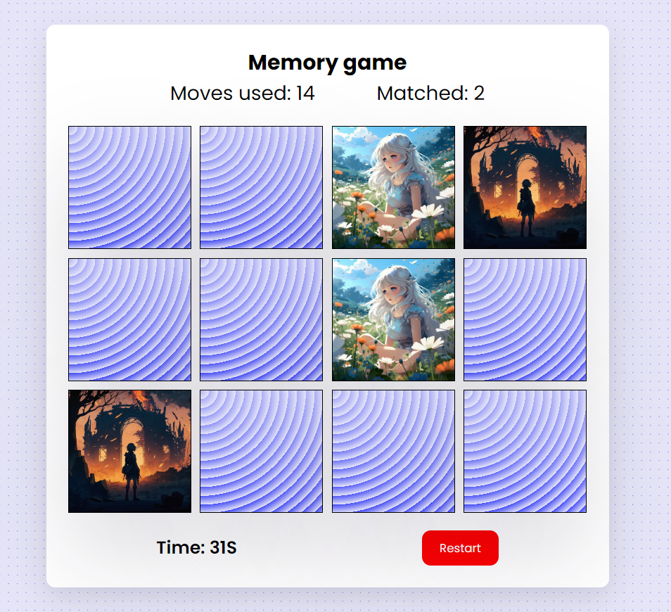

# Memory Game Project

## What is the Memory Game
This is a simple game built to test a users memory. There's a deck of cards with different images. 

## Tech Stack
* HTML
* CSS
* JavaScript

## Challenge
Match cards in less time with less moves.

## How to Play
Load this link in your browser https://memory-game-ajar.netlify.app/

## Instructions
* Click on a card reveal the image
* Keep revealing cards and working your memory to remember each unveiled card.
* Match cards properly with less moves and in faster time

## How I built the Memory Game
I manipulated the DOM with JavaScript, altered part of the HTML and also styled the game
* created a deck of cards that shuffles when game is refreshed
* created a counter to count the number of moves made by player and timer to know the duration of a play time by sections
* added effects to cards when they are unmatched (shake)
* added reset button to reset the game it will shuffle the cards and reset the previous moves and match counter

